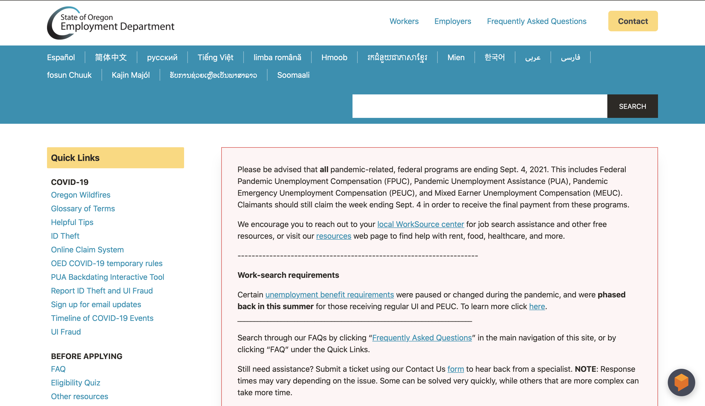

# Assignment 1: Heuristic Evaluation - Mariana Orozco-Berber, DH110

## About this project

Unemployment rates inevitably skyrocketed as COVID-19 restrictions were put in place during the Spring of 2020. Although Oregon’s unemployment rates have been on a steady decline (citation) current demographics suggest the most common age group to be people between the ages of 25 and 34. After going through the unemployment process with family members, I felt a lot of sympathy for the amount of frustration and stress merely applying for unemployment can cause for an individual who is already experiencing difficult circumstances. I believe it is time to modify sites commonly used by the millennial generation to fit their needs as users while maintaining enough simplicity so that the usability is similar across all age-groups.

## Website 1: [State of Oregon Employment Department](https://unemployment.oregon.gov)

About: -----

Goals: ---

### Heuristic Evaluation

|Heuristic Value Description|Evaluation|Reccomendation|Severity Rating|
|--|--|--|--|
|**Visibility of system status:** Design should inform users about the outcome of thei actions.|**Bad:** The site's main headings are too general making the user click through various links before being able to reach a particual page to preform an action.  **Bad:** Quick links are ill-organized and off to the left making it difficult for the user to find what they need. **Good:** The main header stays at the top throughout the entire site.  **Good:** The second header allows for translation to 15 other lanaguges and is consistently at the top throughout the site.|**Reccomendation:** "Apply for Unemployment" should be one of the main headings. The main header should include a COVID-19 Section and it would be helpful if subheadings appeared as the cursor hovers over a heading. The translation option can be smaller and the search bar should not be included within the block of color to maximize the space.|3|
|**Match between the sytem and the real world:** The design uses language familiar to the user and follows real world conventions.|**Good:** The site uses simple lanaguge that does not require definition by hyperlink. **Good:** The site makes a good use of hyperlinks allowing the user to easy go from one place to another. **Bad:** Some references on the site require navigation to the "Glossary terms" page, making the user have to navigate multiple pages to understand one sentence.|**Reccomendation:** Allow users to hover over terms on the Glossary to have a simple definition pop up. Users should also be allowed to click on a Glossary for further detail, but basic information needed to understand a specific sentence should be able to be grasped via a hover defintion.|2|
|**User Control and freedom:** Design should allow users to easily undo actions.| **Good:** The translation header allows for user to switch between lanaguges with little trouble. **Bad:** In order to return to the homapge the user must click on the "Employment Department" logo on the upper left-hand side of the site, which is soemthing only an expert user may think to do.|**Reccomendation:** There should be a visible "Return to Homepage" link, perhaps as a button.|2|
|**Consistency and standards:** Design should use uniform langauge and uniform visual elements|**Bad** The site's main headings do not expand as the user hovers to reveal a more specific directory. **Bad:** Quicklinks and main headings stay where they appear on the homepage throughout the entire site, but there are a few exceptions.|**Reccomendation:** Create a bar of collapsable headings at the top of the page to model the mechanics of most other sites. Create a collapsable "Quick Links" heading do that users have access throughout throughout the site|2|
|**Error Prevention:** Design reduces errors by reducing error-pron conditions|**Bad:** The search bar does not have spelling/grammar check nor does it make sure of preeictive text for suggestions. **Bad:** Follwoing thorugh with a search using misspleled words does not yield a list of possible words the user meant to type or topics they may have meant to search.|**Reccomendation:** The search bar should have predictive text suggestions and any search with misspelled words should yield a "Did you mean?" hyperlink similar to the one on Google.com.|3|
|**Recognition over recall:** Design should make information needed to navigate visible.|**Good:** The Quick Links side bar is very detailed and consstently on the left.  **Bad:** The Quick Links list is very long and may be an information overload for the user.|**Reccomendation:** As stated in previous reccomandations, the Quick Lihnks side bar should be transformed into a "Quick Links" heading which expands to reveal the same links under their respective subheadings. This would allow all of the main information to be easily accessible and better organized.|3|
|**Flexibility and efficiency use:** Design allows for shortcuts so processes can be tailored for all users from novice to expert.|**Bad:** Keyboard shortcuts like "Ctrl-Z" to undo text do not work on the search bar. **Good:** Clicking on the "Employment Department" logo on the upper left-hand side will redirect the user to the homepage.|**Reccomendation:** Design should make use of traditional keyboard shortcuts to navigate the site|1|
|**Aesthetic and minimalist design:** Design elements are geared towards highlighting/accessing essential information.|**Good:** Design is very minimalist and uses a good color palette. **Bad:** The teal block at the top of the page is bulky and distracting when scrolling down the site.|**Reccomendation:** The block should not include the search bar to eliminate the awkward, teal, empty space on the left of it.|0|
|**Help users recognize, diagnose, and recover from errors:** Error messages are expressed in plain language.|**Bad:** Search bar does not suggest commonly searched topics and questions to avoid typos.|**Reccomendation:** As oreviously mentioned, the search bar should make sure of predictive text and suggestions.|3|
|**Help and documentation:** Help with errors should be easily accessible.|**Good:** Site has a contact button whihc stays at the top consistently **Good:** Site has a virtual agent pop up. **Bad:** There are sever FAQ pages which are in small text and difficult to see.|**Reccomendation:** Create an FAQ page organized by differnt sections of FAQ.|2| 

## Website 2: 
