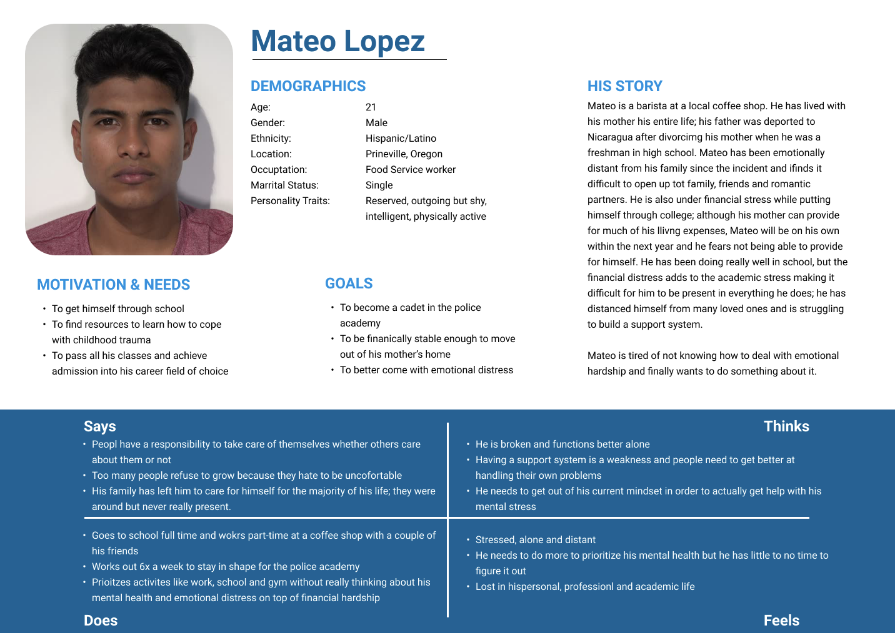

# The Purpose of UX Story Telling
-----

# Two Design Feature Proposals 
-----
1. Mental Health Services Tab
2. ChatBot for services

# Personas & Empathy Map
-------
## Persona 1

## Persona 2

# Scenarios + Journey Map
------
## Maria's Scenario: Mental Health Services tab
### Why
Maria wants to learn how to do a couple of things: 
1. To find counseling services for children
2. To find counseling services for adults
3. To find resources for her students’ parents  

As a mother and a teacher, Maria feels a responsibility to help her children and the community she has built outside of her home. She wants her children to learn how to cope with emotional distress so they grow up with healthy coping mechanisms. She also want to make sure her students are in their best headspace so that learning becomes less of a chore to them and more of an enjoyable experience. Because she teaches very young children, her goal is to help parents understand how emotional stress can affect children in life and in school and how to find help for them. She needs to find information in both English and Spanish given that most of her students are from Spanish-speaking households and only speak English at school. SHe is also in search for counseling services for herself so that she can help guide both her children and her students through the process, and develop healthy mechanisms to cope with her husband’s death and reality of her current life. Information she seeks ranges from counseling services, the importance of mental health care, and crisis hotlines.

### How
One day after work Maria decides she is finally going to prioritize finding information on mental health care and reaching out to professionals. She goes on the Oregon Health Authority Website and is relieved to find a “Mental Health Services” tab on the homepage. This took Maria about 3 seconds and she did not have to navigate through many pages in order to find her starting point. This helped save her some stress from finding out where to go given that the Oregon Health Authority site is a general one with all things related to health from admistrativeoffices to mental health services and low-income nutrition programs. Now she has more time to navigate through the Mental Health Services page to find services for both adults and children while her kids eat dinner. Maria was successful in finding out where she can get her children counseling services with people who have had to deal with traumatic loss. She successfully finds information on where her students’s parents can go to find mental health services for them, and information on how to help a child through emotional distress as a parent. Finally, she is able to access mental health care information for adults like herself to deal with financial stress and traumatic loss. Maria found all of this information within half an hour and still had time to check up on her children before they finished dinner.

## Mateo's Scenario: ChatBot for services
### Why
Mateo wants to do a couple of things:
1. Access information on where he can get himself mental health services
2. Contact someone immediately 

As a busy college student who has a part-time job, Mateo is constantly under stress. He feels like he is about to crack and he wants to speak to someone as soon as possible. He has a couple of exams coming up and has not been doing well in some of his courses, so the next couple of weeks are going to be intense. He knows he will get everything done, but he feels it is time to get help to be able to cope with this stress in a healthy manner. He wants to make sure he prioritizes his mental health so that learning becomes less of a chore and more of an experience and so that he feels more at ease when taking his exams. He also wants to make sure he takes initiative for his own health because soon he will have to be living on his own and he is worried he will not know how to get himself out without his mother around to help direct him. Mateo feels it is his time to care for himself but he dreads going online to search the web for mental health care; it's taboo to him and the longer he contemplates it, the more dreadful it feels. 

### How
One day on his half hour lunch break at work, Mateo decides to go on his phone and navigates to the Oregon Health Authority Website. He has a small window and is trying to set himself up so that when his shift is over, he can call someone to arrange an appointment on his way home–he has an exam the next day and he cannot waste any time, but he does not want to delay his mental health care any longer. Mateo is overwhelmed by the amount of information on the website, and has no idea where to begin. He has 20 minutes left; Mateo finds a chat bubble on the lower left hand corner with the tagline “Ask me a question!” He clicks the bubble and is redirected to an automated assistant that can help simplify the site directory when a user types in key words. The ChatBot asks what it can help with, and Mateo types in “Therapy.” The ChatBot responds by sending Mateo an attached link titled “Peer Counseling Services” which will redirect him to a page on the site that can help him find what he is looking for. Mateo found this information and wrote down a phone number to call after work with 10 minutes left on his break. 
