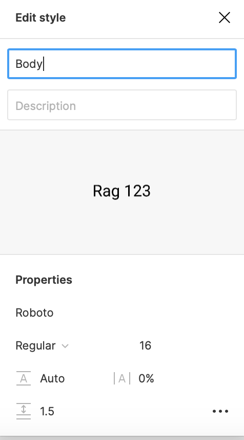
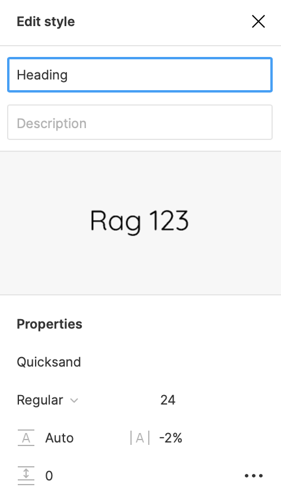
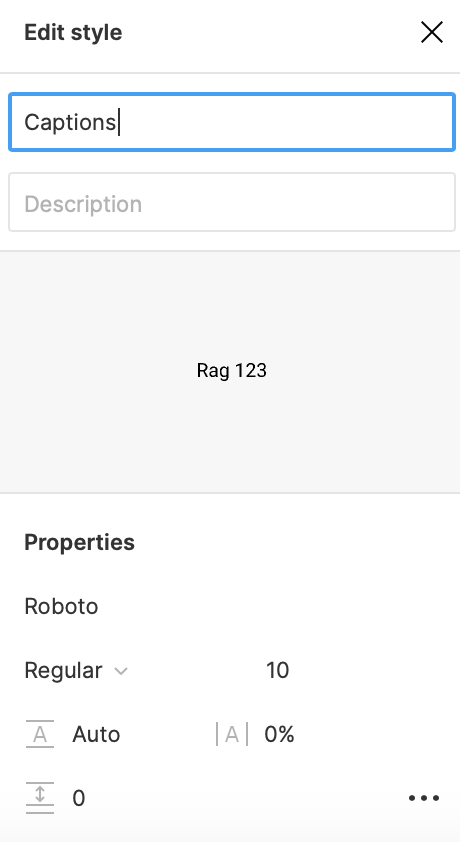
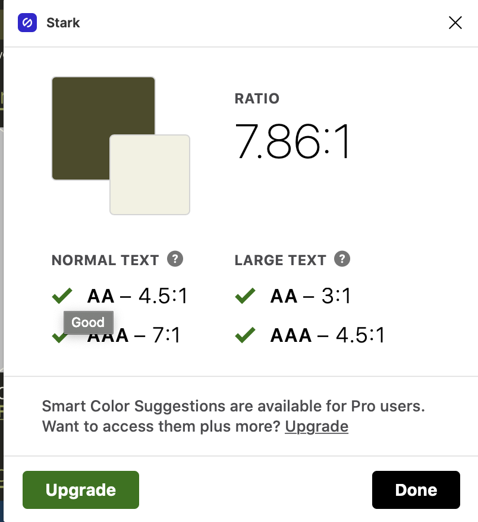
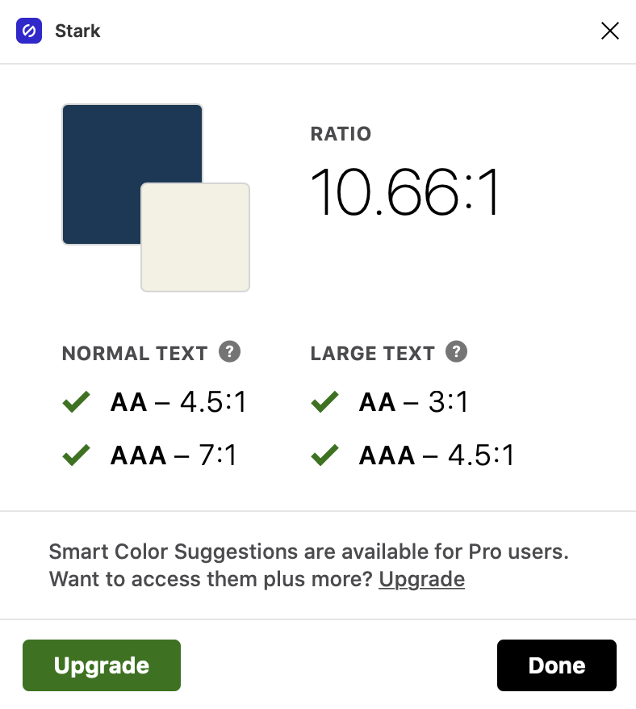

# Digital Humanities Interface Design: Oregon Health Authority Website

## Purpose

The purpose of this project is to make the Oregon Health Authority website, specfically the mental heath services page, mobil-friendly for users who may be in need of therpay or other mental healht services. With suicide in its top 10 leading causes of death (reference), the Oregon mental health page. should not only have releveant information readily accessible but it should serve to allleviate rather than cause stress for its intended audience. This new interface was design to make key pieces of information and contacts accessible without the user having to five through various quick links to get to relevant information. The color scheme is meant to draw the users attention to key compononets like Crisis, Counseling and other related services. 

## [Digitalized Interface Design](https://www.figma.com/file/7Z1M1BWsyReR32XkZcOrk5/Interface-Design?node-id=15%3A64)
> The prototype is designed for an iPhone 13 pro but this similar layout will exists for other smartphone devices. 
The image below illustartes the new interface design using a wireflow I designed with a color palette I chose using Adobe. The prototype is linked [here](https://www.figma.com/file/7Z1M1BWsyReR32XkZcOrk5/Interface-Design?node-id=15%3A64) as well as in the titile of this section.

  

## Typography

  
  
  

I decided to use the font "Roboto" size 16 for the body text because it was the easiest to read and the most neutral font I liked. Given that I wanted to differentiate beteen body and heaidng with both size anf font style, I figured a more netral font would be easier for the user to read. I wanted to use "Quicksand" for all of the title fonts (Heaidng, and subhead) because I feel the think and minimalist font creates a clean aestehtic and makes the page look less overwhelmeing; it no longer look spacked with information, even though a lot of the same content is present. Although the design does not make use of captions and other deatisl often, i decided to add a tyepface for this--I used "Roboto" size 10. I found it approrpate to use the same font as the body text so as to keep some cohesiveness with the design while giving myself the opportunity to include desriptors for ambiguous sections names such as "crisis services"

## Shape

  
  
  

For the regular button however (first row, right) I decided to use a rounded square shape given that this type of button will be used more often and the alignment of less round shapes looks cleaner in a the final design. The chat bubble is composed of a rounded square and an isoceles triangle, they were grouped and flattned to mimic the types of chat bubbles we see on our phones. This will index to the user that this is a place where they can chat with someone for help. I decided to use a more rounded version for the emergency "crisis button." This one is at the top of the page and I felt it best to keep this button round because it complemented the empty space above. The shapes above are tailored to fit a light background; for the dark theme they remain the same shape.

## Color

  
  

 
 
  

