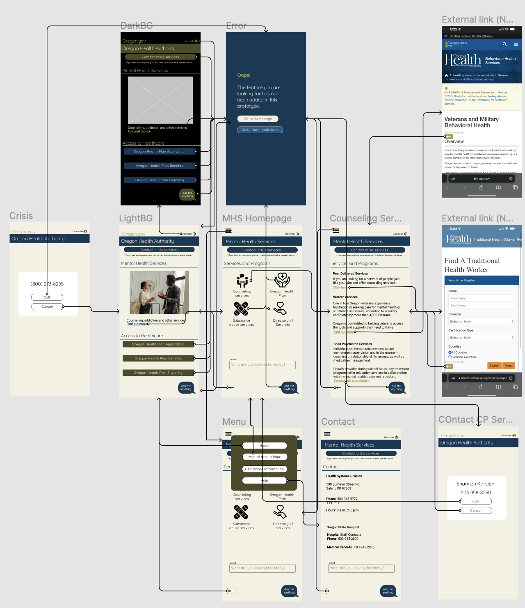

# High Fidelity Prototype: Oregon Health Authority Mobile-Friedly Site

## Purpose
Unemployment rates inevitably skyrocketed as COVID-19 restrictions were put in place during the Spring of 2020. The pandemic affected access to health insuranbce for many urging individuals to apply for government healthcare. With suicicne amongst the top 10 causes of death in the state of Oregon, it is important for the Oregon health website to remain accessible on mobile platforms. I believe it is time to modify sites commonly used by the millennial generation to fit their needs as users while maintaining enough simplicity so that the usability is similar across all age-groups.

## Tasks
Thhe protoype I developed will allow users tofind contact information regarding counseling services and contact a suicide hotline in case of an emergency. Other features that would be included if this project were to be continued include

* A ChatBot: An automated assistant to help users find resources they are unaware of by asking basic questions regarding their needs
* Dark mode: All features available on an interface designed for an environemnt with dim lighting.

## Interactive Prototype
[Figma interactive prototype](https://www.figma.com/proto/C00U1wNqkFykUGLQzX8caz/Interactive-Prototype?node-id=101%3A77&scaling=scale-down&page-id=15%3A64&starting-point-node-id=101%3A77&show-proto-sidebar=1)

## Wireflow and Design
[Figma wireflow and design](https://www.figma.com/file/C00U1wNqkFykUGLQzX8caz/Interactive-Prototype?node-id=15%3A64)

  

## More Information
[Cognitive Walkthrough]()
> *Unavailable at this time*
